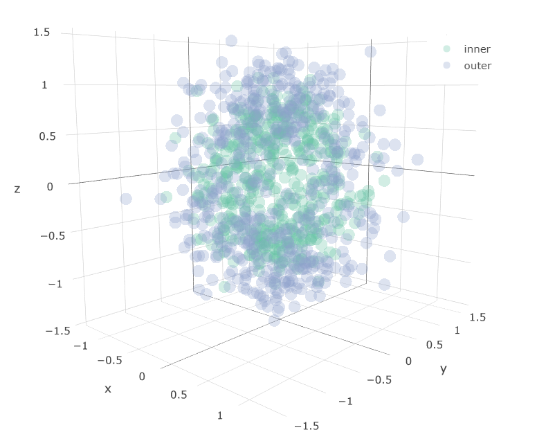
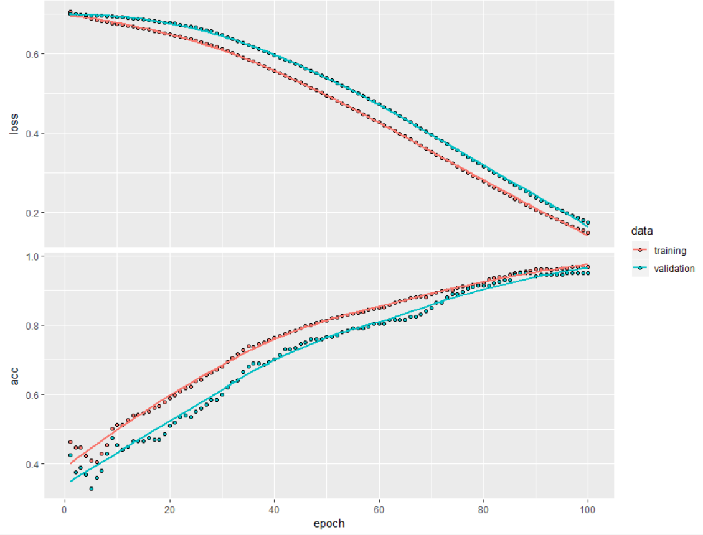
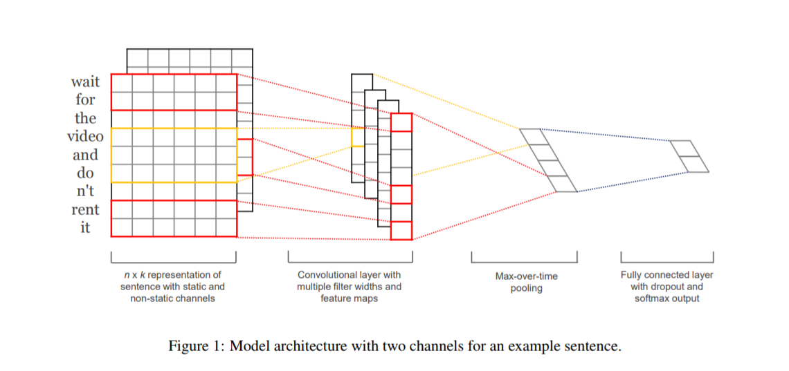
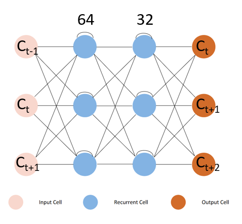

<style>
div.footnotes {
  position: absolute;
  bottom: 0;
  margin-bottom: 10px;
  width: 80%;
  font-size: 0.6em;
}
</style>

<script src="https://ajax.googleapis.com/ajax/libs/jquery/3.1.1/jquery.min.js"></script>
<script src="../js/footnotes.js"></script>


<!-- Hey now, are you reading my source code? -->

```{r setup, include=FALSE}
knitr::opts_chunk$set(echo = FALSE)
library(knitr)
source("../R/util.R")
```

# Preface  

## Relevant XKCD  

<div class="columns-2">


"_The pile gets soaked with data and starts to get mushy over time, so it's technically recurrent._"
</div>

## A bit about this talk  

- We will avoid the Python vs. R flame-war (I use both)
- Not an intro course
- Feel free to contribute!

## Where can I learn more?

- 3Blue1Brown video series on intuitive deep learning<footnote>https://www.youtube.com/watch?v=aircAruvnKk</footnote>
- Chris Olah's Blog for a deep dive<footnote>http://colah.github.io/</footnote>
- Rstudio documentation/examples<footnote>https://keras.rstudio.com/index.html</footnote>

## Why should we care?

- Data is getting larger and our innate ability to grapple with it has not kept pace
- Learning when and how to use a tool is a valuable endeavor in and of itself
- You _may_ be able to automate away many tedious portions of your job 

## A bit about me

- RUG Chair
- MSc. Epidemiology from London School of Hygiene and Tropical Medicine
- "Multi-disciplinarian" approach to Epidemiology at the agency

## Agenda

0. Background on Keras and Tensorflow
1. Brief model building basics
2. Some Examples

# Part 0. Keras and Tensorflow

## What is a "Tensorflow"

- Massively popular deep learning library for Python, C++, Julia, (and R)  
- Provides domain-specific language for constructing a graph-based model
- Parallelized, distributed, and GPGPU-based back-ends

<div class="centered">
```{r tf-image, out.width = "500px"}
include_graphics("../img/tf.png")
```
</div>

## Okay, what is a "keras"?  

- Higher-level interface for Tensorflow, CNTK, and Theano
- More approachable for most, model internals hidden away
- Useful for rapidly prototyping models

<div class="centered">
```{r keras-image, out.width = "500px"}
include_graphics("../img/keras.png")
```
</div>

## Keras R API  

- Centered around Reticulate package
- Syntax remains "python-ic", with some caveats  
- Interfaces Python directly behind the scenes

```{r installing_keras, echo = TRUE, eval=FALSE}
# Installing Keras & Tensorflow
# NOTE: Requires Python, pip
devtools::install_github("rstudio/keras")
library(keras)
install_keras()
```

# 1. Model Building Basics

## Checklist

*I might use deep learning when...*

- Data are not linearly separable in low dimensions 
- The "why" is less important than the "what"
- There is a lot of labeled data to work with

# Binary classification of three dimensions

## Setup  

Classification of points sampled from the surface of two encapsulated spheres  

- Input: 3 features (x, y, and z coordinates [-1, 1])
- Output: 1 binary indicator (inner, outer)
- 5-fold cross validation (20% held back from training)

<div class="centered">
```{r spheres_plot, out.width = "400px"}

```
</div>

## Making our data  

```{r make_spheres, echo = TRUE}
input <- make_spheres(samples = 1000L, factor = 0.5, noise = 0.1)
head(input, 10)
```

```{r spheres_picture, eval = FALSE, echo = FALSE}
# NOTE: Producing the picture from the previous slide
# (This does not display on a slide)
plot_ly(input,
    x = ~x,
    y = ~y,
    z = ~z,
    color = ~id,
    opacity = 0.3
  ) %>%
  add_markers(type = "scatter")
```

## Building a model  

*Two main constructor functions* 

- `keras_model_sequential(layers = layers, name = name)`
    - Tidy-like syntax with pipe  
    - Some model topologies may be difficult using this approach

- `keras_model(inputs, outputs = NULL)`
    - Manually create layers as objects in R  
    - Specify input and output layer of model to function  

## Building a model

Simple 3 layer feed-forward model
 - Stochastic Gradient Descent optimizer, Binary cross entropy loss

```{r sphere_model, eval = FALSE, echo = TRUE}
model <- keras_model_sequential(name = "my_model") %>%
    layer_dense(
        units = 10,
        activation = "relu",
        input_shape = shape(3)
    ) %>%
    layer_dense(units = 10, activation = "relu") %>%
    layer_dense(units = 10, activation = "relu") %>%
    layer_dense(units = 2, activation = "softmax") %>%
    compile(
        optimizer = "sgd",
        loss = "binary_crossentropy",
        metrics = "accuracy"
    )
```

## Fitting the model 

Fitting a model uses the `fit()` function with a few arguments:

```{r fit_sphere_model, eval = FALSE, echo = TRUE}
out <- fit(
    model,
     x = as.matrix(input[, c("x", "y", "z")]),
     y = cbind(
       as.double(input[, "id"] == "inner"),
       as.double(input[, "id"] == "outer")
     ),
     epochs = 100,
     batch_size = 100,
     validation_split = 0.2,
     shuffle = TRUE
)

plot(out)
```

## Fitting the model  

*If everything goes according to plan, you'll see something like this:*

```{r sphere_fit_plot, out.width = "600px"}

```


# 2. A Few examples

# Classification | Deep Text Classification

## Deep Text Classification - Motivations

<div class="columns-2">
- Test result field is plain-text
- Finite set of canonical values to correct to
- Lots of historical labeled data from a lookup table


- Thousands of dirty values every year per pathogen (2005--present)
- My system works on 4 pathogens (STEC, Shigella, Salmonella, Campylobacter)
- **The task of data cleaning every year is mine**
</div>
## Examples {.build}

*Correct value:* 
Shigella sonnei

```
">100,000 cfu/ml Shigella sonnei Readback and verified by xxxx yyyy  Printed to 
infection control   Sent to  Laboratory for Confirmatory Typing. >100,000 cfu/ml
Escherichia coli 10,000 - 50,000 cfu/ml Normal skin flora isolated"
```

*Correct value:* 
STEC O157 _(no H antigen reported)_

```
***Corrected Results Below***   Escherichia coli 0157 Results called to xxxx at 
yyyy by zzzzzz Patient ID and test results read back.   >>>>>>>>>> 
Previous results reported in error; see previous results below. Escherichia coli
serogroup 0157:H7 Results called to xxxx at 7/5/2017 20:22:09 by xxxx Patient ID
and test results read back.
```

## Deep Text Classification -- Model

- Transformed raw text to padded sequences using tokenizer
- Adapted a model from Kim, 2014<footnote>[arXiv:1408.5882 [cs.CL]](https://arxiv.org/abs/1408.5882)</footnote> for multiple classes
- Also assisted by Python code from Bhavesh Vinod Oswal<footnote>https://github.com/bhaveshoswal/CNN-text-classification-keras</footnote>

<div class="centered">
```{r cnn_graph, out.width = "600px"}

```
</div>

## Deep Text Classification -- Model

- One model per pathogen trained on ASPEN
- Model and weights saved and versioned
- Models re-loaded in processing pipeline for serotype prediction

# The code

## Deep Text Classification -- Results

Since I will still be looking over all of the corrections manually,
I had a pretty low threshold for "success".

*Accuracy on test set:*  

- Campylobacter: 88%
- Shigella: 83%
- STEC: 73%
- Salmonella: 80%

## Deep Text Classification -- Results

There is plenty of room for improvement here:

- No handling of class imbalance
- No regularization, simple encoding
- No artificial data created  
- Went for a model that worked with one pathogen and scaled

## Deep Text Classification -- Next Steps

- Better models?
- 90+% accuracy?
- Fully automated data cleaning?

# Regression | RNN Time Series Analysis

## Motivation

- Classification is "easy" with large amounts of labeled data  
- What if you don't have labeled data?
- What if you don't even know what you're looking for?  

## Intuition  

*Regression is, in a sense, a filtering problem*  

- Time periods of epidemiological importance obfuscated by local, seasonal trends
- Auto-regressive, trend components are a "nuisance" to be learned and filtered
- The residual is the signal, provided the only error is due to measurement error

## Unsupervised to Supervised

- If we don't have labels of interest (outbreaks, clusters, etc), we could use the data itself
- Compute case counts at time $t,...,t+n$ from counts at time $t-1\,...\,t-n$ 
- Seasonality, temporal patterns all learned through recurrent topology  

<div class="centered">
```{r rnn_view, out.width = "400px"}

```
</div>

## A primer  

# Questions? | Sean Browning, MSc. (NCEZID/DFWED/EDEB)